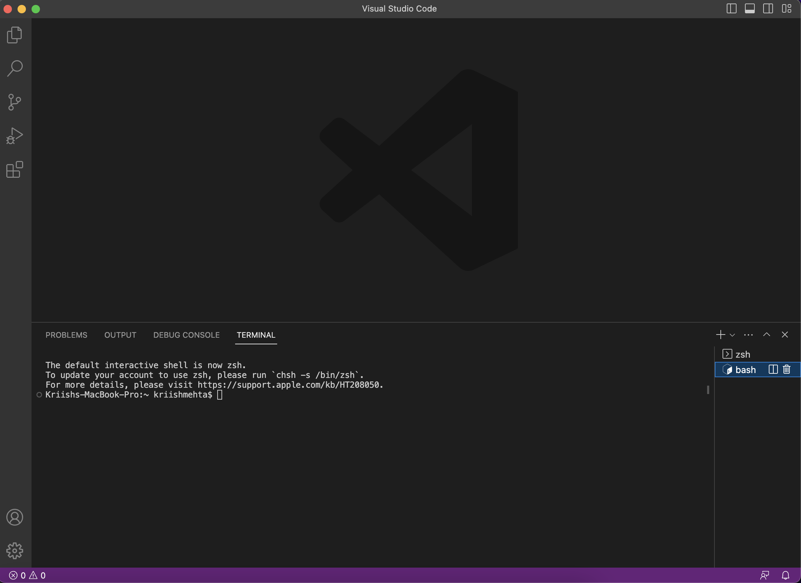
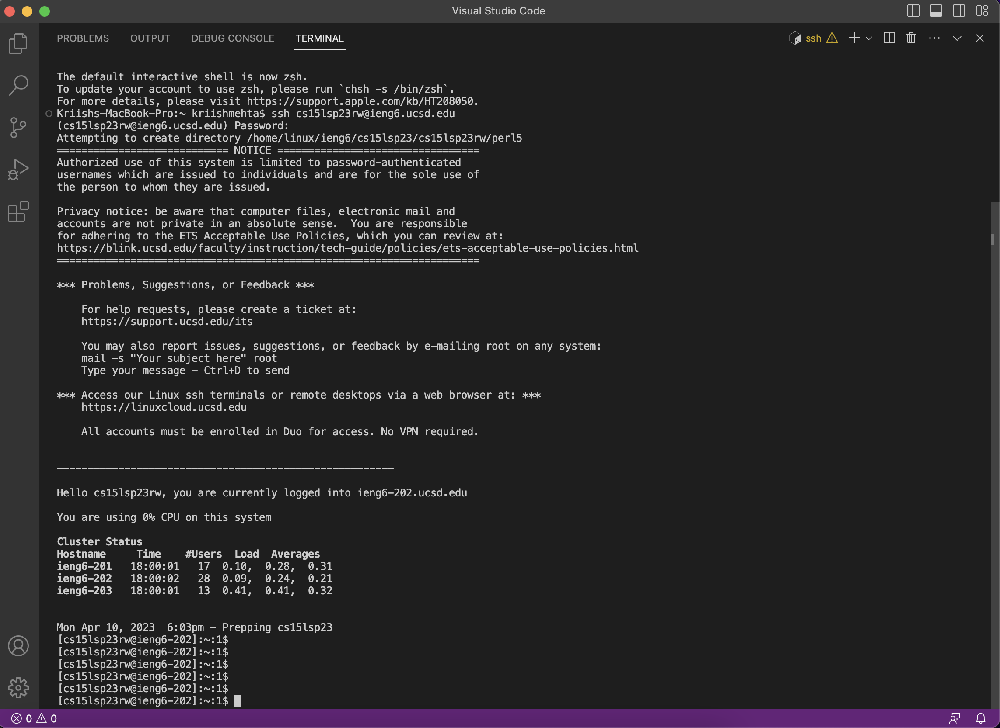
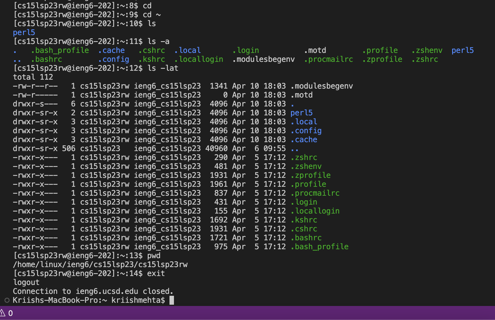

# CSE 15L
## Lab Report 1

**Step 1: Installing VS Code**
- I already had VS Code installed on my computer and so I simply just opened a new window on it.
- Then I started a new terminal to enter the commands I needed to start the remote connection. I also made sure to switch to bash as recommended by the tutor.
- Here is how my screen looked once I did that:

**Step 2: Remotely Connecting**
- To establish the remote connection, I first reset the password associated with my CSE 15L account on this [Website](https://sdacs.ucsd.edu/~icc/index.php)
- Then, I opened VS Code and opened up a new terminal and ran the following command (replace *zz* with the letters from your specific account ID) :
~~~
ssh cs15lsp23zz@ieng6.ucsd.edu 
~~~
- It then prompted me for a password that I had just created and after entering that, the remote connection was successfully established.
- *NOTE*: When typing the password, the characters do not show on screen but are still getting typed. So, type out the password fully and then press enter.
- Here is how my screen looked once the remote connection was successfully established:

**Step 3: Running Commands**
- I ran a few commands to test out how everything worked. 
- It was interesting to see the outputs I got and changes that occured from the commands.
- Here is a snippet of what I did and what it resulted in:

- To briefly describe each command:

    1) `cd` and `cd ~`
    Both these commands navigate to the home directory, from whatever directory one is currently in. 
    Also even though it is not done in the screenshot, we can also change directory using cd by adding a file/directory name after cd, and that would become our current     working directory (given that the file exists).

    2) `ls`
    This command lists all the files/directories in the current directory, *except for* hidden files and directories.

    3) `ls -a`
    This command lists all the files/directories in the current directory, *including* hidden files and directories.

    4) `ls -lat`
    This command combines three options with ls: l, a, t. 
    -l indicates a long list with detailed information about each file/directory in separate lines.
    -a indicates that all files/directories (including hidden ones) are included in the list.
    -t indicates that the files are listed in the order in which they were last modified (newest first).
    Together these three combine to produce the output we see in the snippet above.

    5) `pwd`
    This command prints the current working directory.

    6) `exit`
    This command helps us log out of the remote server in our terminal. We can also use Ctrl-D to achieve the same.
