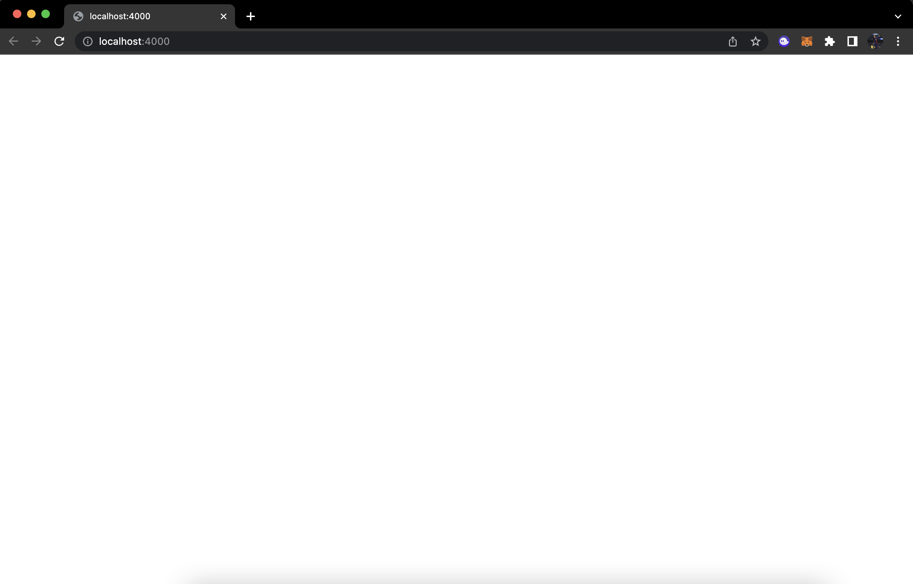

# CSE 15L
## Lab Report 2

**Part 1**
- The following image shows my code for `StringServer`: 

- The code basically keeps track of a string variable called `s`, which gets manipulated based on the specific request, which in this case is of the type
` /add-message?s=<string> `.
- The existing string variable gets concatenated with a newline (`\n`) and the value in place of `<string>`, and the result is displayed.

- The following screenshots show examples of using `/add-message`.
- - Initially:
    
  - Request 1:
    
  - Request 2:
    

- For each of the two requests, the `handleRequest(URI url)` method gets called, which essentially takes the url of our server as an input, manipulates
our string variable if the condition is met and then returns the contents of this variable to be displayed on the webpage.
- Initially, the string variable `s` contains an empty string (`""`), and so nothing is displayed as seen in the first image.
- Once we make our first request, the method is called and the condition is met. So, the string variable is updated and the new content is displayed.
- Each time we make a request to the server, the `url` variable of type `URI` is updated to reflect the current url of our server. So for example,
in the initial image, the `url` is simply [http://localhost:4000](http://localhost:4000). But in request 1, it gets updated to [http://localhost:4000/add-message?s=This%20is%20the%20first%20example](http://localhost:4000/add-message?s=This%20is%20the%20first%20example)
- The variable `parameters` stores two strings - it splits the query by the `=` sign, and so we have our `<string>` in index 1. We access this to update our existing string variable `s` as described earlier. Each time `parameters` has different values in it as the content of the `String` passed changes.
- So the value of variable `s` changes and finally, we return `s` and the updated content is displayed on the webpage as seen in the screenshots above.

**Part 2**
- I have chosen the bug in the `reversed()` method in `ArrayExamples.java`. The following is the original code snippet for the method:
~~~
  // Returns a *new* array with all the elements of the input array in reversed
  // order
  static int[] reversed(int[] arr) {
    int[] newArray = new int[arr.length];
    for(int i = 0; i < arr.length; i += 1) {
      arr[i] = newArray[arr.length - i - 1];  // bug in this line -> tries to assign value from new array, which only has default values 0
    }
    return arr;  // bug in this line -> returns old array
  }
~~~
The bug in this program is that it assigns values from the new array, whose elements are all the default value (0), to the old array, when instead it is supposed to do the opposite. It also returns the old array itself instead of returning the new, reversed array.

- The following is a failure-inducing input for the buggy program as a JUnit Test, that helped me identify the bug:
~~~
import static org.junit.Assert.*;
import org.junit.*;

public class ArrayTests {
  @Test
  public void testReversed2() {
    int[] input1 = { 2, 1 };
    assertArrayEquals(new int[]{ 1, 2 }, ArrayExamples.reversed(input1));
  }
}
~~~
Here, instead of getting our expected array output, we actually get `{0, 0}` since we assign the default value 0 from the newly created `int[]` array. So our test ends up failing.

- The following is an input that doesn't induce a failure despite the code being buggy:
~~~
import static org.junit.Assert.*;
import org.junit.*;

public class ArrayTests {
  @Test
  public void testReversed() {
    int[] input1 = { 0 , 0 };
    assertArrayEquals(new int[]{ 0 , 0 }, ArrayExamples.reversed(input1));
  }
}
~~~
Here, we don't get a failure as the new array has default values of 0 that get assigned to the old array, and since we expect our output array to have only 0s as elements, it ends up working out.

- The following screenshot shows the output of running these tests:

- The following is the code snippet after fixing the bug:
~~~
  // Returns a *new* array with all the elements of the input array in reversed
  // order
  static int[] reversed(int[] arr) {
    int[] newArray = new int[arr.length];
    for(int i = 0; i < arr.length; i += 1) {
      newArray[i] = arr[arr.length - i - 1];  // fixed bug -> we now assign the value from the old array to the new array 
    }
    return newArray;  // fixed bug -> we return the new reversed list
  }
  ~~~
After making the above changes both our tests succesfully pass and we get the desired outputs. The first change we made was making sure that we assigned the last element of the old array as the first element of the new one, which ensures the new array has elements in reverse order of the older one. Earlier we were assigning values from opposite arrays causing the bug. The next change was simply returning the new array that we created to store the elements in reverse order, rather than returning the old array itself. Both these changes together fixed bugs from our code and helped us successfully implement what we wanted to do.

**Part 3**

In weeks 2 and 3, something that I learned from lab that I didn't know before was how to build and run a server. This was something that really stood out to me personally and I really enjoyed seeing how we can create servers either on our own local computer (`localhost`) or on a remote computer through `ieng6`. It was fascinating to explore the different ways we could manipulate the url and make use of different queries to update the webpage in distinct ways. Another thing I found interesting was how ports work, and especially seeing that on the remote computer when multiple people tried using the same port, which caused an error saying that address was already in use. 
In summary, I learned how to build and run a server, access different parts of the url and use queries to manipulate the content on webpages, and overall gained a deeper insight on how web servers work.
