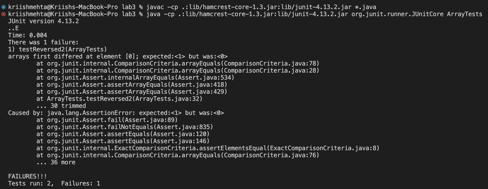

# CSE 15L
## Lab Report 2

**Part 1**
- The following image shows my code for `StringServer`: 

- The code basically keeps track of a string variable called s, which gets manipulated based on the specific request, which in this case is of the type
` /add-message?s=<string> `.
- The existing string variable gets concataneated with a newline (`\n`) and the value in place of `<string>`, and the result is displayed.

- The following screenshots show examples of using `/add-message`.
- - Initially:
    
  - Request 1:
    
  - Request 2:
    
- For each of the two requests, the `handleRequest(URI url)` method gets called, which essentially takes the url of our server as an input, manipulates
our string variable if the condition is met and then returns the contents of this variable to be displayed on the webpage.
Initially, the string variable `s` contains an empty string (`""`), and so nothing is displayed as seen in the first image.
Once we make our first request, this method is called and the condition is met and so, the string variable is updated and the new content is displayed.
- Each time we make a request to the server, the `url` variable of type `URI` is updated to reflect the current url of our server. So for example,
in the initial image, the `url` is simply [http://localhost:4000](http://localhost:4000). But in request 1, it gets updated to [http://localhost:4000/add-message?s=This%20is%20the%20first%20example](http://localhost:4000/add-message?s=This%20is%20the%20first%20example)
- The variable `parameters` stores two strings - it splits the query by the `=` sign, and so we have our `<string>` in index 1. We access this to update our existing string variable `s` as described earlier.
So the value of variable `s` changes as well. Finally, we return `s` and the updated content is displayed on the webpage.

**Part 2**
