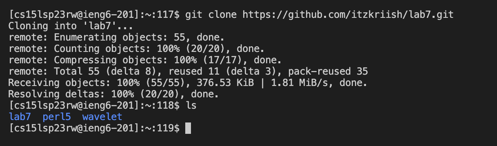
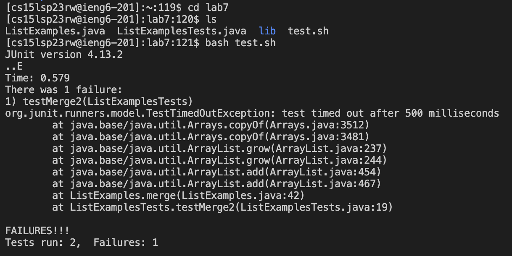
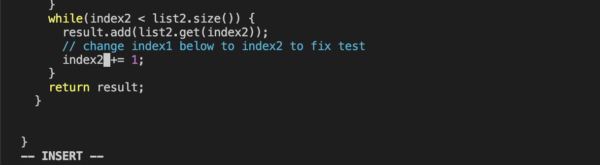
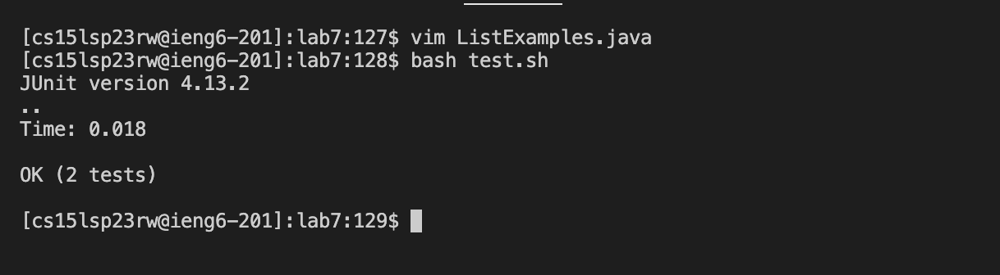
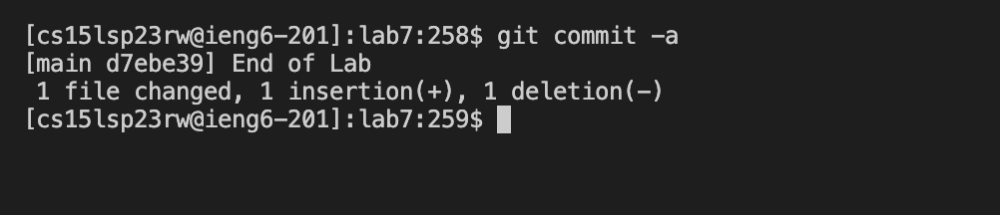

# CSE 15L
## Lab Report 4

**Log into ieng6**
- Keys Pressed: `<up> <up> <enter>`
- Explanation: The command to login to ieng6, `ssh cs15lsp23rw@ieng6.ucsd.edu` was 2 up in the search history, and so I accessed it that way to login.
I did not have to enter my password since I already setup SSH keys for my account. 
- 

**Clone your fork of the repository from your Github account**
- Keys Pressed: `<command -c> git clone <command -v> <enter>`, `ls <enter>`
- Explanation: I first copied the web url of the repository. Then, I typed 'git clone' in the terminal and pasted the url. This command succesfully cloned my fork of the repository.
- 

**Run the tests, demonstrating that they fail**
- Keys Pressed: `cd lab7 <enter>`, `ls <enter>`, `bash test.sh <enter>`
- Explanation: First, I navigated to the `lab7` directory that we just cloned. I then used the `ls` command to see the contents of the directory. Finally, I ran the tests by running the `test.sh` file, and we saw that 1 of the tests failed.
- 

**Edit the code file to fix the failing test**
- Keys Pressed: `<Ctrl -r> vim <enter>`, `x`, `i`, `2 <esc>`, `:wq! <enter>` 
- Explanation: I used reverse search in bash to access my search history and find the command `vim ListExamples.java` to open the file with `vim`. Then I used my trackpad to navigate to the error in line 43 and put the cursor on the '1' of `index1`.
I then pressed 'x' to delete the '1', 'i' to enter insert mode, '2' to make it into `index2`, then `<esc>` to exit the insert mode, and then finally exited `vim`.
- 

**Run the tests, demonstrating that they now succeed**
- Keys Pressed: `<up> <up> <enter>`
- Explanation: The command `bash test.sh` was 2 up in the search history as we ran it right before the previous command, and so I accessed it using the up arrow. It then ran the tests and we saw that now all of the tests succeeded.
- 

**Commit and push the resulting change to your Github account**
- Keys Pressed: `git commit -a <enter>`, `i`, `End of Lab <esc>`, `:wq! <enter>`
- Explanation: I committed the changes, and added the message through `vim` by entering insert mode, typing the message and then exiting out. Finally, I pushed the changes to my account.
-  
