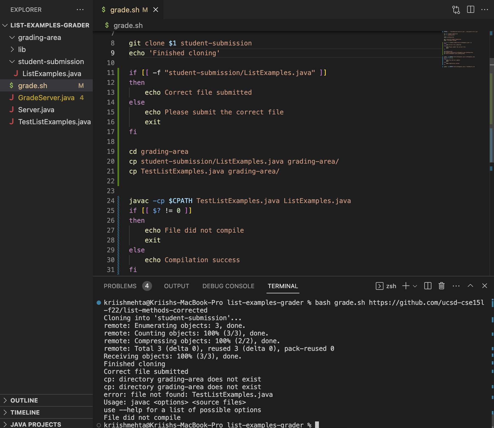
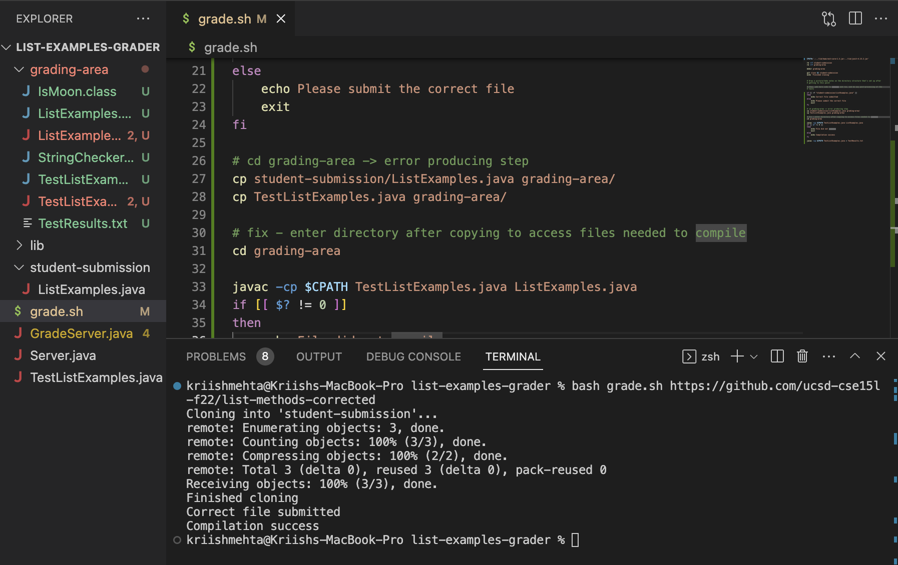
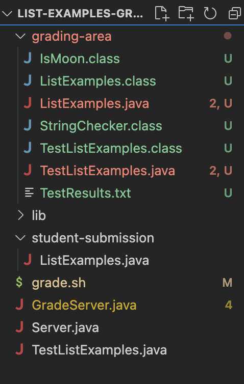

# CSE 15L
## Lab Report 5

### Part 1 - Debugging Scenario

**Original Student Post**

*Title*: Need Help Debugging `grade.sh`

*Category*: Debugging

*What environment are you using (computer, operating system, web browser, terminal/editor, and so on)?*

I'm using VS Code Terminal on my MacBook 

*Detail the symptom you're seeing. Be specific; include both what you're seeing and what you expected to see instead. 
Screenshots are great, copy-pasted terminal output is also great. Avoid saying “it doesn't work”.*

My grade.sh script can successfully clone the repository of the student submission as well as check that the correct file is submitted.
It however, fails when I try to copy the necessary files - `TestListExamples.java` and `ListExamples.java` - into the grading area
directory. I get two errors:

1) `cp: directory grading-area does not exist` 

2) `error: file not found: TestListExamples.java`

This then causes the rest of the script to break as well and so the file does not compile. But I do have a directory being created called 
`grading-area` and the file is present as well as you can see in the following screenshot:



*Detail the failure-inducing input and context. That might mean any or all of the command you're running, a test case, command-line arguments, 
working directory, even the last few commands you ran. Do your best to provide as much context as you can.*

The command I am running is : `bash grade.sh https://github.com/ucsd-cse15l-f22/list-methods-corrected`. I even tested on other repositories,
and it fails at the same step every time.

Can you please provide me some guidance on what I should look into? Thanks!

**TA Response**

Hi,

It looks like the error you are facing is as a result of not being in the correct directory. Look at the file structure and your code, and
you would definitely notice the error. Specifically, when you `cd` into `grading-area`, do you need to do that to copy files into it? And
after that command, think about what directory you are in and whether your target files are present or not.

Hope this helps!

**Student Response**

I got it! I understood that I was looking for the files in the wrong directory, and need to track directory changes better.

The bug was that I did `cd` into `grading-area` before copying files into it, as in my mind I needed to be in that directory to copy the files
into it, which is not required. So, when I tried looking for the files and tried to copy them into the directory, I got errors as those files
did not exist in the directory I was in, and since I was already ing `grading-area` I got an error saying the directory did not exist. 

I managed to fix it by copying over the files into the directory, while being in the home directory. And then changing directories to `grading-area`
after so that I could access the files needed for compilation. The screenshot below shows the fix and that it works fine now:



Thank you for your help!

### Summary of Debugging Scenario

**Contents of File Before**

```
CPATH='.:../lib/hamcrest-core-1.3.jar:../lib/junit-4.13.2.jar'

rm -rf student-submission
rm -rf grading-area

mkdir grading-area

git clone $1 student-submission
echo 'Finished cloning'

if [[ -f "student-submission/ListExamples.java" ]]
then
    echo Correct file submitted
else 
    echo Please submit the correct file
    exit 
fi

cd grading-area
cp student-submission/ListExamples.java grading-area/
cp TestListExamples.java grading-area/

javac -cp $CPATH TestListExamples.java ListExamples.java 
if [[ $? != 0 ]]
then
    echo File did not compile
    exit
else
    echo Compilation success
fi

javac -cp $CPATH TestListExamples.java > TestResults.txt
```


**Contents of File After**
```
CPATH='.:../lib/hamcrest-core-1.3.jar:../lib/junit-4.13.2.jar'

rm -rf student-submission
rm -rf grading-area

mkdir grading-area

git clone $1 student-submission
echo 'Finished cloning'

if [[ -f "student-submission/ListExamples.java" ]]
then
    echo Correct file submitted
else 
    echo Please submit the correct file
    exit 
fi

# cd grading-area -> error producing step
cp student-submission/ListExamples.java grading-area/
cp TestListExamples.java grading-area/

# fix - enter directory after copying to access files needed to compile
cd grading-area 

javac -cp $CPATH TestListExamples.java ListExamples.java 
if [[ $? != 0 ]]
then
    echo File did not compile
    exit
else
    echo Compilation success
fi

javac -cp $CPATH TestListExamples.java > TestResults.txt
```


**Command(s) Ran**

```bash grade.sh https://github.com/ucsd-cse15l-f22/list-methods-corrected```


**Final File and Directory Structure**




**Description of Edit Needed to Fix the Bug**

We need to track changes in directories and keep in mind how that affects the files we are trying to obtain. We changed directory
to `grading-area` before copying the files from the home directory. This way when we tried to copy over the files into `grading-area`,
we got an error as we were already in that directory and no such files existed in that directory. We fixed this by changing directories
after adding the necessary files, as for compilation we needed to then access these files from the `grading-area` directory. We could also
have potentially changed the file-paths in out `cp` command to copy those files from the home directory/their respective directory.

Overall, a simple bug like this caused us to encounter different errors. I personally faced this error while making the script and so thought
it would be perfect for this lab task. We need to be more mindful and aware of the file and directory structure, and keeping track of changes
can help us be on top.


### Part 2 - Reflection

Something interesting that I learned in the second half of this quarter has definitely got to be `vim`. I didn't know anything about it before, but definitely found it a very useful tool. I believe it will make my life easier knowing how to use `vim` as I found the process of 
file editing much easier and more efficient than traditionally editing files. I think that especially in future programming classes, I will be 
making use of it a lot. It was cool to see how its syntax with the commands works and I am glad I got to learn about it this quarter. Overall, 
I feel this class has taught me a lot and that knowing useful commands and tricks for navigating the terminal will be something that will help
me in the future!
